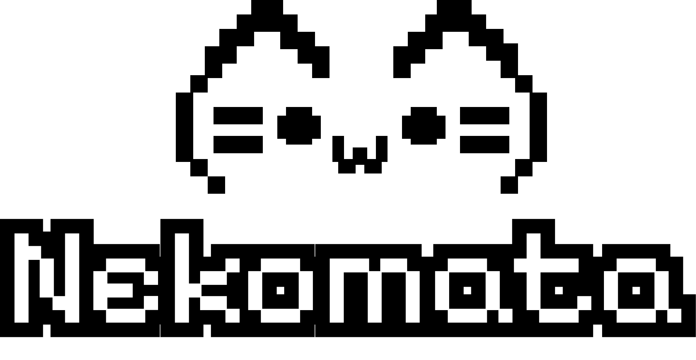

<p align="center">
  <picture>
    <source media="(prefers-color-scheme: dark)" srcset="assets/Nekomata_dark.png">
    <source media="(prefers-color-scheme: light)" srcset="assets/Nekomata_light.png">
    
  </picture>
</p>

# Nekomata

Nekomata is an open-source, **true-native hot-reload library for C/C++**. It
maps changed source and header inputs to affected translation units, consumes
complete object-file generations produced by the application's build
integration, relocates them against the live process's real addresses, and
redirects function entry points:

- **no restarts** — the process keeps running, the next call takes the new code
- **no refactor** — no plugins, no interface indirection, no library splits
- **state preserved** — globals and statics keep their values across reloads

[](https://github.com/sentomk/Nekomata/actions/workflows/ci.yml)

## Status

The core mechanism works end to end on Linux/ELF. What follows is the honest
boundary: what Nekomata does today, and what it refuses rather than what nobody
has tried yet.

| Capability | Today |
|---|---|
| Hot reload | one or more translation units per atomically published generation, `-O0`, Linux/ELF |
| Managed groups | embedded ELF descriptors, immutable multi-consumer generation streams, managed `watch()`/`unwatch()`, and structured update events |
| Build integration | managed adapters are specified for CMake, GNU Make, GN, and Meson, but are not implemented yet |
| Dependency discovery | legacy GCC/Clang Make depfiles through `depfile_planner`; incomplete graphs are rejected |
| State preservation | globals and statics keep their values across reloads |
| Multiple functions per reload | yes — applied all-or-nothing; a failed attempt rolls back |
| PIE binaries | yes, when hot objects are built `-fpie` (GOT-style `-fpic` is not supported yet) |
| Cross-TU references | not supported yet — a reloaded function cannot call into another unit |
| New globals, changed global layout | not supported yet — refused with a diagnostic |
| Virtual functions | not supported yet — a vtable that needs relocation is refused with a diagnostic |
| Optimized builds (`-O2`) | not supported yet — an inlined function has no body of its own |
| Platforms | Linux/ELF runtime; kernel and TUI portability builds on macOS and Windows |
| Compilers | GCC and Clang ≥ 14 for live reload; MSVC 2022 for portability builds |
| TUI reload control | experimental — its manual trigger does not coordinate application threads yet |

Thread coordination is the caller's responsibility. `reload_session` performs
no internal synchronization, so its member calls must be externally serialized.
Before calling `update()`, the caller must ensure that no thread can enter or
execute reloadable code, and keep that code quiescent until `update()` returns.
All objects in one published generation are prepared before the first entry
write and committed together or rolled back together. See the
[reload model](docs/reload-model.md) for the ready-marker format.

## Try it (Linux)

```sh
bash scripts/configure.sh debug
bash scripts/build.sh debug
bash build/debug/examples/hello_reload/run_demo.sh
```

The demo edits `tick()` from `++g_counter` to `g_counter += 10` while the
process runs, and asserts the counter continues from its old value: state
survives the swap, no restart. Expected transcript:
`examples/hello_reload/expected_output.txt`.

## When you should NOT use Nekomata

Being honest about the boundary is part of the design:

- **Restarts cost seconds?** Use mold/lld + ccache + incremental builds — faster
  and more reproducible. Nekomata sells *state preservation*, not raw speed.
- **Stateless, rolling-restart services?** Hot reload is a non-need.
- **Compliance-forbid self-modifying code** (finance/aviation/medical)? Skip.
  Nekomata is a development-time tool, not a production hot-patcher.
- **Verification & release builds** must stay reproducible and clean — hot reload
  serves iteration only and never enters shipped artifacts.

## Building from source

### Requirements and pinned tools

Requirements: Python ≥ 3.8 with `venv`, plus a C++20 compiler (GCC ≥ 11 /
Clang ≥ 14 / MSVC 2022). A default developer build is:

```sh
bash scripts/configure.sh debug
bash scripts/build.sh debug
bash scripts/test.sh debug
```

`configure.sh` takes a preset name first and forwards any remaining arguments
to CMake. `build.sh` and `test.sh` likewise forward additional arguments to
`cmake --build` and CTest. All shell entrypoints invoke `tools/envsetup.py`
automatically; it only installs and verifies CMake 3.31.10, Ninja 1.13.2 and
clang-format 22.1.8 in the ignored `.tools/venv`. Exact pins live in
`tools/requirements.txt`, shared by local development and CI. The first
bootstrap needs network access unless that environment is already populated.

### CMake options

| Option | Default | Effect |
|---|---:|---|
| `NEKOMATA_BUILD_TESTS` | `ON` | Build the test suites and register them with CTest. |
| `NEKOMATA_BUILD_TOOLS` | `ON` | Build development-only utilities; these are not a supported driver CLI. |
| `NEKOMATA_BUILD_EXAMPLES` | `ON` | Build the Linux acceptance demo and playground. |
| `NEKOMATA_BUILD_FUZZ` | `OFF` | Build the Linux/Clang libFuzzer targets; normally enabled by the `fuzz` preset. |
| `NEKOMATA_TUI` | `OFF` | Build the optional `nekomata::tui` library and TUI tests. |
| `NEKOMATA_WARNINGS_AS_ERRORS` | `ON` | Promote project warnings to errors. |
| `NEKOMATA_ENABLE_SANITIZERS` | `OFF` | Enable sanitizers; normally enabled by the `asan` preset. |
| `NEKOMATA_ENABLE_CLANG_TIDY` | `OFF` | Run clang-tidy on library, platform and development-tool targets. |
| `NEKOMATA_ENABLE_DWARF_INSPECTION` | `ON` | Build Linux DWARF metadata support and its tests. |

For a smaller library-only build:

```sh
bash scripts/configure.sh release \
  -DNEKOMATA_BUILD_TESTS=OFF \
  -DNEKOMATA_BUILD_TOOLS=OFF \
  -DNEKOMATA_BUILD_EXAMPLES=OFF \
  -DNEKOMATA_ENABLE_DWARF_INSPECTION=OFF
bash scripts/build.sh release --target neko
```

### Enabling the TUI

The TUI is an optional library, not a separate product driver. Enable it at
configure time, then link `nekomata::tui` alongside `nekomata::neko`:

```sh
bash scripts/configure.sh debug -DNEKOMATA_TUI=ON
bash scripts/build.sh debug
bash scripts/test.sh debug -R '^neko\.tui\.'
```

The build first tries an installed Glyph package. Point CMake at that prefix
with `-DCMAKE_PREFIX_PATH=/path/to/prefix`. If Glyph is not installed, CMake
fetches the pinned Glyph v0.4.0 source, which requires network access on first
configuration. Restricted or offline environments can provide a checkout
directly:

```sh
bash scripts/configure.sh debug \
  -DNEKOMATA_TUI=ON \
  -DFETCHCONTENT_SOURCE_DIR_GLYPH=/absolute/path/to/Glyph
```

Reconfigure the same preset with `-DNEKOMATA_TUI=OFF` to disable it.

### Presets and development checks

- `debug` — unoptimized developer build.
- `release` — optimized build of the library itself; live reload at `-O2` is not
  supported yet.
- `asan` — debug build with AddressSanitizer and UndefinedBehaviorSanitizer.
- `tidy` — debug build with clang-tidy enabled.
- `fuzz` — Linux/Clang build of the fuzz targets.

Static analysis builds tests and examples but analyzes only the library, enabled
platforms and development utilities. CI pins clang-tidy 18 and treats enabled
diagnostics as errors:

```sh
CC=clang-18 CXX=clang++-18 bash scripts/configure.sh tidy \
  -DNEKOMATA_CLANG_TIDY_EXECUTABLE=clang-tidy-18
bash scripts/build.sh tidy
```

Formatting is enforced in CI with the pinned clang-format 22:

```sh
bash scripts/format.sh --check  # or --fix
```

Linux DWARF metadata support needs a C compiler for libdwarf 2.3.2. It is
enabled by default for repository development and fetches the pinned source on
first configuration. Either disable it with
`-DNEKOMATA_ENABLE_DWARF_INSPECTION=OFF` or provide an existing source tree:

```sh
bash scripts/configure.sh debug \
  -DFETCHCONTENT_SOURCE_DIR_LIBDWARF=/absolute/path/to/libdwarf-code-2.3.2
```

Native CMake presets remain available directly to environments that already
provide CMake ≥ 3.21 and Ninja.

Platform notes:

- **Linux** — the primary target and the only live-reload runtime today.
- **macOS** — the platform-neutral kernel builds; the TUI also builds when
  enabled, but there is no runtime backend.
- **Windows** — the kernel and TUI build under MSVC; there is no PE/PDB runtime
  backend yet.

## Contributing

See [CONTRIBUTING.md](CONTRIBUTING.md) for conventions, the testing doctrine,
and the suite map; [AGENTS.md](AGENTS.md) carries the same rules for AI coding
agents. [docs/reload-model.md](docs/reload-model.md) records the intended runtime
API, transaction and TUI responsibility boundaries. The managed group,
publication, and build-adapter contracts are described in
[the managed reload design](docs/managed-reload-design.md),
[CMake integration](docs/cmake-integration-design.md),
[GNU Make integration](docs/make-integration-design.md),
[GN integration](docs/gn-integration-design.md), and
[Meson integration](docs/meson-integration-design.md). These adapter documents
are designs, not claims that the integrations already ship. The planned work —
including what is deliberately out of scope — is in
[docs/roadmap.md](docs/roadmap.md).

## License

Nekomata is licensed under the [MIT License](LICENSE).

## Credits & prior art

- [Live++](https://liveplusplus.tech/) — a commercial hot-reload tool for C/C++,
  with an implementation blog series worth reading:
  [Introduction](https://liveplusplus.tech/blog/posts/2026-01-26-introduction.html),
  [Phase 0](https://liveplusplus.tech/blog/posts/2026-02-09-phase_0_motivation_goals.html),
  [Phase 1](https://liveplusplus.tech/blog/posts/2026-02-23-phase_1_build_information.html).
- [RuntimeCompiledCPlusPlus](https://github.com/RuntimeCompiledCPlusPlus/RuntimeCompiledCPlusPlus) —
  pioneered runtime recompilation; source of the dependency-graph idea.
- [crosire/blink](https://github.com/crosire/blink),
  [fungos/cr](https://github.com/fungos/cr),
  [ddovod/jet-live](https://github.com/ddovod/jet-live) — the surveyed open-source
  projects exploring native hot reload.
- [Microsoft Detours](https://github.com/microsoft/Detours) — the classic
  reference for function interception and trampolines.
- [LLVM ORC](https://llvm.org/docs/ORCv2.html) — kindred machinery for runtime
  relocation and memory management.
